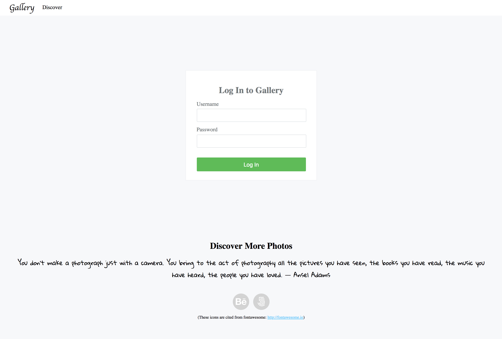
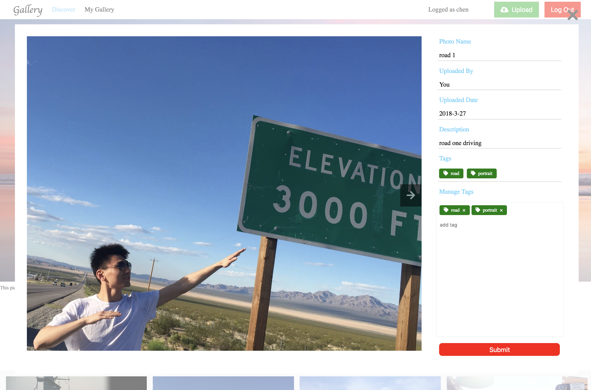
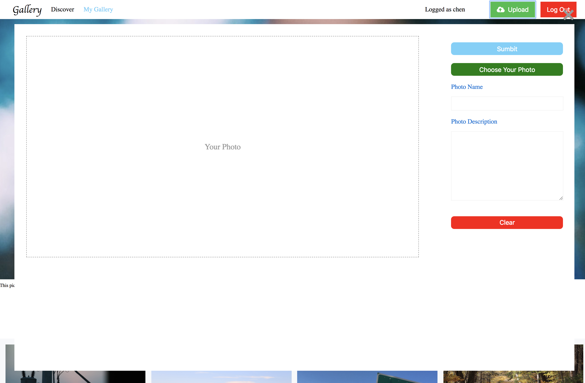

# CS3300-project3
For This Project, I will design and implement an online photo gallery in PHP. My photo gallery will be backed by a database which I will use to store information about the images uploaded to your gallery. To help organize the photos in my gallery, I will implement the ability for users of my site to tag the photos. I will also implement login/logout functionality and user access controls to control who can upload photos on my site.

 ##  Design and Intro
[Design Plan](design-plan/design-plan.md) 
[Skectch1](design-plan/sketch1.jpg) 
[Skectch2](design-plan/sketch2.jpg) 
[Wireframe1](design-plan/wf1.jpg) 
[Wireframe2](design-plan/wf2.jpg) 
[Wireframe3](design-plan/wf3.jpg) 
[Wireframe4](design-plan/wf4.jpg)

 

 

 

 

 

 

 My sketches illustrate that users can review all pictures at one time in gallery.  If user login, he or she can view all pictures which were uploaded on 'My Gallery' page, user can filter pictures by a tag, upload or delete a picture as well, the layout of this website is concise for user to manipulate, every functionality can be done in one page, which is very convenient for a user.
