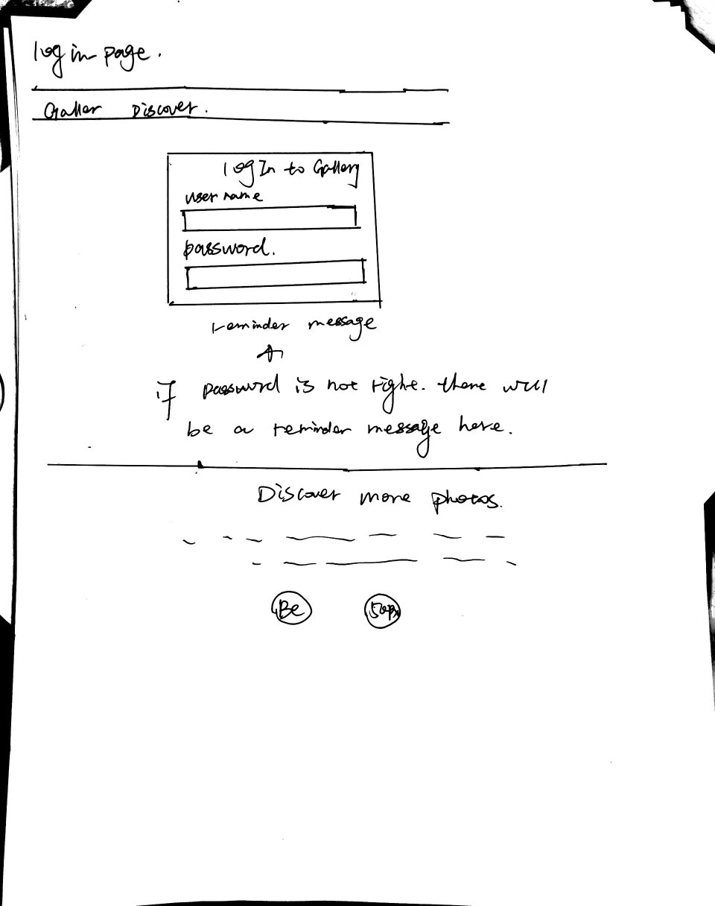

# Project 3 - Design & Plan

Your Name: Chen Li

## 1. Persona

I've selected Abby as my persona.

I've selected my persona because her personality represents a large number of users, a huge number of users don't have much spare time to learn new technologies and prefer to use methods that they familiar with.  If I design a gallery that works comfortably for this persona, this gallery will be a good design for both users with low computer self-efficacy and users with high computer self-efficacy.  an easy-to-use website always performs well for all people.

## 2. Sketches & Wireframes

### Sketches


### Wireframes




My sketches illustrate that for user can review all pictures at one time in gallery, the layout is concise for user to manipulate, every functionality can be done in one page, which is very convenient for a user.

## 3. Database Schema Plan

[Describe the structure of your database. You may use words or a picture. A bulleted list is probably the simplest way to do this.]

Table: user
* user_id: PRIMARY KEY UNIQUE INTEGER NOT NULL AUTOINCREMENT
* user_name: TEXT NOT NULL
* user_session: NOT NULL UNIQUE TEXT

Table: image
* image_id: PRIMARY KEY UNIQUE INTEGER NOT NULL AUTOINCREMENT
* user_id: INTEGER NOT NULL ON DELETE CASCADE
* upload_date: TEXT NOT NULL
* file_name: TEXT NOT NULL
* file_ext: TEXT NOT NULL
* image_description: TEXT
* FOREIGN KEY(user_id) REFERENCES user(user_id)

Table: tag
* tag_id: PRIMARY KEY UNIQUE INTEGER NOT NULL AUTOINCREMENT
* tag_name: TEXT NOT NULL UNIQUE

Table: image_tag
* tag_id: INTEGER NOT NULL
* image_id: INTEGER NOT NULL
* FOREIGN KEY(tag_id) REFERENCES tag(tag_id) ON DELETE CASCADE
* FOREIGN KEY(image_id) REFERENCES image(image_id) ON DELETE CASCADE
* PRIMARY KEY(tag_id, image_id)


## 4. Database Query Plan
select all tags used for photos
```sql
SELECT tag.tag_name FROM tag JOINS (SELECT DISTINCT tag_id FROM image_tag) as TAG ON tag.tag_id = TAG.tag_id
```
select singe image from image table
```sql
SELECT * FROM image WHERE image_id = :imageID
$params = array(
      ':imageID' => $imageID
    );
```
select all tags used for one image
```sql
SELECT tag.tag_name FROM tag JOINS (SELECT tag_id FROM image_tag WHERE image_id = :imageID) as A ON tag.tag_id = A.tag_id
$params = array(
      ':imageID' => $imageID
    );
```
select all images from image table
```sql
SELECT * FROM image
```
select all images according to tag
```sql
SELECT * FROM image_id WHERE image_id = (SELECT image_id FROM image_tag WHERE tag_id = (SELECT tag_id FROM tag WHERE tag_name = :tagName))
$params = array(
      ':tagName' => $tag
    );
```
add existing tags to a image
```sql
INSERT INTO image_tag (tag_id, image_id) VALUES (:tagID, :imageID);
$params = array(
      ':tagID' => $tagID
      ':imageID'=> $imageID
    );
```
add new tag to a image
```sql
INSERT INTO tag (tag_name) VALUES (:tagName);
$params = array(
      ':tagName' => $tagName
    );
INSERT INTO image_tag (tag_id, image_id) VALUES (:tagID, :imageID);
$tagID = $db->lastInsertId("tag_id");
$params = array(
          ':tagID' => $tagID
          ':imageID'=> $imageID
        );
```
delete tags from images
```sql
DELETE FROM image_tag WHERE tag_id IN :tagArray AND image_id = :imageID
$params = array(
          ':tagArray' => $tagArray
          ':imageID'=>$imageID
        );
```
delete image
```sql
DELETE FROM image WHERE image_id = :imageID
$params = array(
          ':imageID'=>$imageID
        );
```


## 5. Structure and Pseudocode

### Structure

[List the PHP files you will have. You will probably want to do this with a bulleted list.]

* index.php - main page.
* header.php - header.
* footer.php - footer.
* init.php - initial.

### Pseudocode

[For each PHP file, plan out your pseudocode. You probably want a subheading for each file.]

#### index.php

```
include init.php
include header.php
for loop to display all tags, which can be selected by user or guest
for loop to display all images in database
$sql = SELECT * FROM image;
$images = exec_sql_query($db, $sql, $params)->fetchAll()
for image in $images {
  echo each image in <a> tag making url = "index.php?imageID=image_id"

}

include footer.php

```

#### includes/init.php

```
messages = array to store messages for user
print_messages function
handle_db_error function
exec_sql_query function
open_or_init_sqlite_db
check_login function
log_in function
log_out function


```

#### header.php

```
create a form for user login and logout
print current user name is there is a user logging in
<?php
     if ($current_user) {
       echo "Logged in as $current_user";
     }
?>


```

## 6. Seed Data - Username & Passwords

[List the usernames and passwords for your users]

* user1 : chen
* password: lc1993124
* user2 : yun
* password: sqy123

[Create tables]
Table: user
* user_id: PRIMARY KEY UNIQUE INTEGER NOT NULL AUTOINCREMENT
* user_name: TEXT NOT NULL
* user_session: NOT NULL UNIQUE TEXT

Table: image
* image_id: PRIMARY KEY UNIQUE INTEGER NOT NULL AUTOINCREMENT
* user_id: INTEGER NOT NULL ON DELETE CASCADE
* upload_date: TEXT NOT NULL
* file_name: TEXT NOT NULL
* file_ext: TEXT NOT NULL
* image_description: TEXT
* FOREIGN KEY(user_id) REFERENCES user(user_id)

Table: tag
* tag_id: PRIMARY KEY UNIQUE INTEGER NOT NULL AUTOINCREMENT
* tag_name: TEXT NOT NULL UNIQUE

Table: image_tag
* tag_id: INTEGER NOT NULL
* image_id: INTEGER NOT NULL
* FOREIGN KEY(tag_id) REFERENCES tag(tag_id) ON DELETE CASCADE
* FOREIGN KEY(image_id) REFERENCES image(image_id) ON DELETE CASCADE
* PRIMARY KEY(tag_id, image_id)
create user
```sql
CREATE TABLE user (
  user_id PRIMARY KEY UNIQUE INTEGER NOT NULL AUTOINCREMENT,
  user_name TEXT NOT NULL,
  user_session NOT NULL UNIQUE TEXT,
  user_password TEXT NOT NULL
);
```
create image
```sql
CREATE TABLE image (
  image_id PRIMARY KEY UNIQUE INTEGER NOT NULL AUTOINCREMENT,
  user_id INTEGER NOT NULL,
  upload_date TEXT NOT NULL,
  file_name: TEXT NOT NULL,
  image_description: TEXT,
  FOREIGN KEY(user_id) REFERENCES user(user_id) ON DELETE CASCADE   
);
```
create tag
```sql
CREATE TABLE tag (
  tag_id PRIMARY KEY UNIQUE INTEGER NOT NULL AUTOINCREMENT
  tag_name TEXT NOT NULL UNIQUE
);
```
create image_tag
```sql
CREATE TABLE tag_image (
  tag_id INTEGER NOT NULL,
  image_id INTEGER NOT NULL,
  FOREIGN KEY(tag_id) REFERENCES tag(tag_id) ON DELETE CASCADE
  FOREIGN KEY(image_id) REFERENCES image(image_id) ON DELETE CASCADE
  PRIMARY KEY(tag_id, image_id)  
);
```
